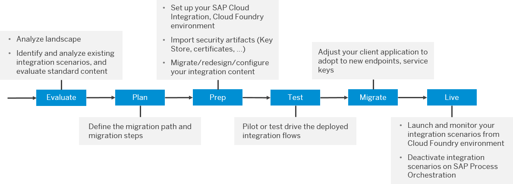

<!-- loio46c8a368b7dd4f20826cfbe498d1601c -->

# Interface Migration Strategy

When migrating from SAP Process Orchestration to SAP Integration Suite on Cloud Foundry, there are different options and strategies for the migration process itself.

At the current state, SAP is working on a migration tool to support customers on a fully automated migration of integration artifacts. The tool is not available yet and might be released with different function sets in the first stages, but in general it will include:

-   Extraction tool to extract required information about the SAP Process Orchestration system such as:

    -   Landscape

    -   Integration Scenarios

    -   Protocols / Adapters / Attributes / Mappings

    This information will be used to generate a high-level list of artifacts that need to be considered. It can also be used to feed the migration tool for an automatic conversion.

-   Automatic migration/conversion
    -   Using the extracted data of objects from SAP Process Orchestration, these objects are converted automatically to artifacts in SAP Integration Suite.

    -   Depending on the release level and the particular scenarios, some manual activities might be required.

The migration process itself can be covered by a migration project, which can contain different phases as illustrated in the following diagram:

1.  **Evaluate**
    -   Analyze the current and the to-be landscape. SAP recommends using the [SAP Integration Solution Advisory Methodology](https://blogs.sap.com/2019/02/24/integration-solution-advisory-methodology-isa-m-define-integration-guidelines-for-your-organization/).

    -   If not available, create a high-level architecture for the connected systems and a detailed list of these systems with the used protocols, adapters, triggers, and authentication.

    -   Check if there are other options to integrate the systems on the [SAP API Business Hub](https://api.sap.com/) such as:

        -   Standard Integration Packages

        -   Standard APIs documentation

2.  **Plan**

    Create a migration strategy.

    -   Migration of integration scenarios

        -   Automatically migrated \(depending on the availability and features of SAP Migration Tool\)

        -   Semiautomatic migrated \(SAP Migration Tool, import of mappings, import of artifacts\)

        -   Redesign scenarios \(standard content, standard APIs, interfaces not covered by the SAP Migration Tool\)

    -   Side-By-Side Migration

        Scenarios can be converted and run in parallel to SAP Process Orchestration.

    -   Prioritization of the integration scenario

        Depending on different aspects of the customer like business or functional requirements and availability of features on Cloud Integration

3.  **Preparation/Implementation**
    -   Cloud Foundry Setup

        -   Provisioning of tenant and SAP Integration Suite

        -   Configuration of SAP Integration Suite \(authorization and roles\)

    -   Import / Configuration of artifacts

        -   Certificates, user credentials, known-host file, public and private keyring.

    -   Setup of Cloud Connector \(if required\)

    -   Connectivity test to the connected applications \(optional\)

    -   Setup of implementation guidelines and architecture, mainly in case of redesigning integration scenarios

    -   Migration of content

        -   Configuration of standard content

        -   Automatic migration

        -   Reimplementation for redesigned interfaces and non-supported objects by the SAP Migration Tool.

4.  **Test**

    Different test phases to test the migrated content \(e.g., connectivity, developer, unit, process, system, acceptance\)

5.  **Migrate Connected System / Go-Live**
    -   Activate integration content on productive tenant

    -   Configuration of connected system to switch over to Cloud Integration

6.  **Live**
    -   Monitoring of integration processes

    -   Decommission plan for SAP Process Orchestration

The migration phases can be adjusted to the needs of the customer and the preferred project methodology. There are different options to execute the phases.

<a name="loio46c8a368b7dd4f20826cfbe498d1601c__section_b3c_m53_qqb"/>

## Migrating Cloud Integration from the Neo Environment to the Multi-Cloud Foundation

SAP provides a comprehensive [guide for migrating integration scenarios in the Cloud Integration tenant from Neo environment to the Multi-Cloud Foundation](https://help.sap.com/viewer/de9f95b388f1489abc3c7890a66bae2f/LATEST/en-US/e97a93d541ff45c6b513317ca3c5e620.html). The guide addresses Cloud Integration customers who have at least one existing integration scenario in the Neo environment that they would like to move to a tenant in the Multi-Cloud Foundation. It’s possible to also use this guide for migrating integration scenarios from one tenant to another tenant within the same environment.

The migration of Cloud Integration from Neo to Cloud Foundry allows you to keep current on the roadmap for the offerings inside SAP BTP and it brings benefits such as:

-   Availability on hyperscale environments, such as Amazon Web Services, Microsoft Azure, and Alibaba Cloud

-   Scalability

-   Asynchronous JMS message queues

-   B2B Libraries

-   Different services in SAP Integration Suite in a unified commercial offering

-   No downtime for upgrade and maintenance activities

Be aware of some restrictions that you may find while migrating from Neo to Cloud Foundry. Some of them are:

-   The audit log access via Cloud Integration Monitoring UI is not supported.

-   Access to system log files is not supported.

-   RFC adapter with principal propagation on a tenant that is hosted in Cloud Foundry environment is not supported.

-   Customers can move their Cloud integration license from Neo to Cloud Foundry and perform the technical migration of the Content tenant afterwards.

    > ### Note:  
    > Such “as-is” migration is not available for Enterprise Edition, App Edition, and Enterprise Messaging Upsell \(8005999\). SAP Integration licenses shall be considered for such cases. For more details, contact your SAP representative.

For the full list, see SAP Note [2752867](https://launchpad.support.sap.com/#/notes/2752867).

