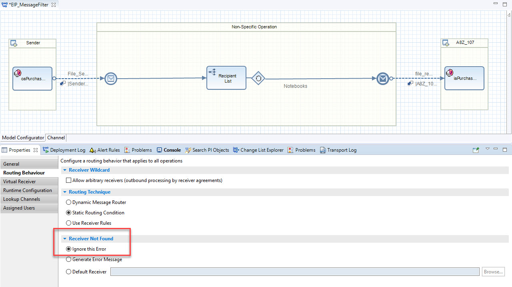

<!-- loiobf613cf418564dad99ab830ef9d095d7 -->

# Message Filter

The [Message Filter](https://www.enterpriseintegrationpatterns.com/patterns/messaging/Filter.html) pattern is similar to the [Content-Based Router pattern](https://blogs.sap.com/2020/02/21/enterprise-integration-patterns-at-sap-cloud-platform-integration-content-based-routing/). For the Message Filter pattern however, you only have one single receiver. Any incoming message is evaluated, and if it meets the routing criteria specified by the filter, the message is routed to the receiver, or is discarded otherwise.

<a name="loiobf613cf418564dad99ab830ef9d095d7__section_tld_21k_qqb"/>

## SAP Process Orchestration

The Message Filter can be modeled similarly to the Content-Based Router. It corresponds to the Content-Based Router variant where the message is ignored if the receiver can’t be determined. The only difference is that it only has one single receiver, see the following figure.

<a name="loiobf613cf418564dad99ab830ef9d095d7__section_xpp_21k_qqb"/>

## Cloud Integration

On Cloud Integration, the Message Filter pattern is modeled using a router flow step with one route pointing to the actual receiver and a default route pointing to an End event. In our case, messages with the product category Notebooks are routed to the receiver. Otherwise, the messages are discarded. For a detailed description, see [Message Filter](https://help.sap.com/viewer/368c481cd6954bdfa5d0435479fd4eaf/Cloud/en-US/bd523460894744a8be6b7bbe3351f795.html).

